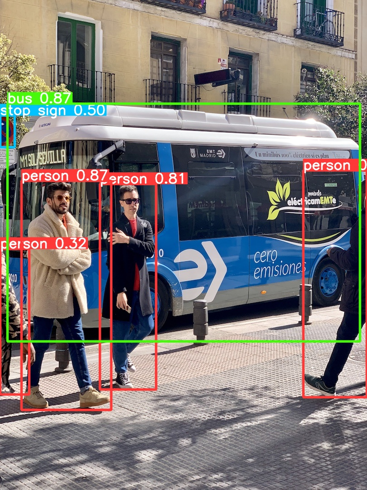

# models_trt_exportor

this repository is the script of Convert, which convert onnx Model to TRT. Support TRT Model Mode:

- FP16
- INT8

 Support Model List

   :white_check_mark:  YOLOV8

   :white_check_mark:  YOLOX

TODO List:

- [ ] check inference speed of int8

## How To Use ?

1. you need a Environment of Python, and `Pyhon >= 3.8`. Can use Conda to create env

    ```shell
    conda create -n trt_exporter python=3.8
    conda activate trt_exporter
    git clone git@github.com:Hsomething/models_trt_exportor.git
    cd models_trt_exportor && pip install -r requirements.txt
    ```

    

2. Install TensorRT to Python
   
   **Install CUDA ToolKit**
   
   ```shell
   wget https://developer.download.nvidia.com/compute/cuda/11.1.1/local_installers/cuda_11.1.1_455.32.00_linux.run
   sudo sh cuda_11.1.1_455.32.00_linux.run
   ```
   
   **Install cudnn**
   
   download cudnn from   https://developer.nvidia.com/rdp/cudnn-archive

   ```shell
   tar -zxvf cudnn-11.3-linux-x64-v8.2.1.32.tar.gz
   cp -r cuda/lib64/* /usr/local/cuda/lib64/ && cp -r cuda/lib64/* /usr/local/cuda-11.1/lib64/
   cp -r cuda/include/* /usr/local/cuda/include/ && cp -r cuda/include/* /usr/local/cuda-11.1/include/
   ```
   
   **Install TensorRT**
   
   ```shell
   wget https://developer.nvidia.com/downloads/compute/machine-learning/tensorrt/secure/8.6.1/tars/TensorRT-8.6.1.6.Linux.x86_64-gnu.cuda-11.8.tar.gz
   tar -zxvf TensorRT-8.6.1.6.Linux.x86_64-gnu.cuda-11.8.tar.gz && cd TensorRT-8.6.1.6
   export LD_LIBRARY_PATH=/home/aistudio/work/TensorRT-8.6.0.12/lib:$LD_LIBRARY_PATH
   export LIBRARY_PATH=/home/aistudio/work/TensorRT-8.6.0.12/lib::$LIBRARY_PATH
   ```
   

3. Run And Export

    ```shell
    # python exporter.py -m /path/your/onnx/model.onnx -w 2 -s 640 
    python exporter.py -m ./yolo8s.onnx -w 2 -s 640 
    # fp16
    python exporter.py -m ./yolo8s.onnx -w 2 -s 640 -fp16
    # int8
    python exporter.py -m ./yolo8s.onnx -w 2 -s 640 -int8 -d /dir/of/train/set/images
    
    # In same level of model you will get yolo8s.engine/yolo8s_fp16.engine/yolo8sint8.engine
    ```

    

## Infer Times

   Test Environment:
   > - GPU: 2080Ti
   > - cuda: 11.4
   > - cudnn: 8.2.4
   > - TensorRT: 8.6.1
   > - PyTorch: 2.0.1
   > - OnnxRuntime-GPU: 1.16.2
   > - Opencv: 4.8.0.74

| Model structure | Backend           | test times | Language | Pipeline Avg Time(ms) | infer Avg Time(ms) |
| --------------- | ----------------- | ---------- | -------- | --------------------- | ------------------ |
| YOLO8-s         | PyTorch           | 100        | Python   | 21.5                  | 6.3                |
| YOLO8-s         | PyTorch(Half)     | 100        | Python   | 19.95                 | 4.8                |
| YOLO8-s         | OnnxRuntime       | 100        | Python   | 62.7                  | 8.2                |
| YOLO8-s         | OnnxRuntime(Half) | 100        | Python   | 65.48                 | 8.1                |
| YOLO8-s         | TensorRT          | 100        | Python   | 27.06                 | 6.2                |
| YOLO8-s         | TensorRT(Half)    | 100        | Python   | 24.31                 | 3.72               |



